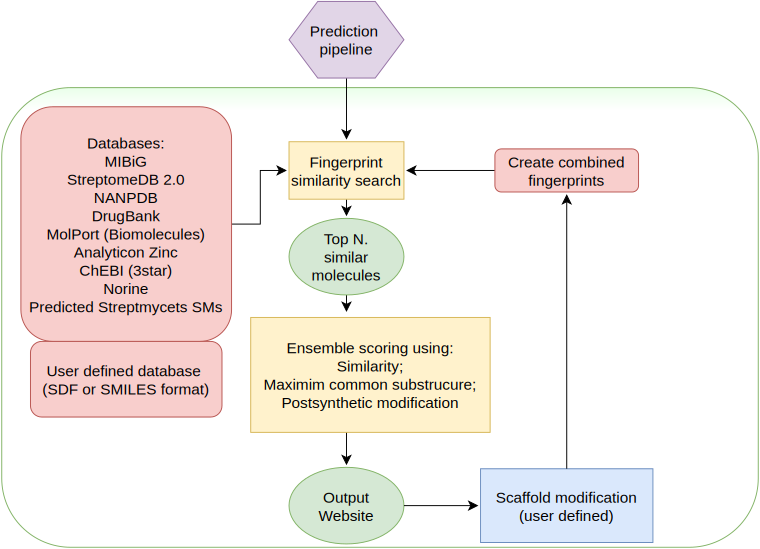

.. _db_screening:

Database screening
##################

SeMPI allows to screen publicly available natural compound databases (DBs). 
The query can be the predicted scaffolds of a cluster, a user defined modification of 
scaffolds or a totally user defined set of molecules.

The DB screening is not limited to one scaffold. SeMPI can predict multiple fragment-scaffolds for one cluster (in case the order of the blocks cannot be determined). The screening allows to submit multiple scaffolds for one query.

Additionally to the precomputed DBs, the user can upload custom defined DBs in SDF or SMILES format.

The database screening can also be performed for user defined molecules and molecule sets, 
entirely without preliminarily prediction.
Just follow the
`Scaffold upload <http://sempi.pharmazie.uni-freiburg.de/scaffold_upload>`_
and submit any molecule query to the screening algorithm.

Use cases
=========

The database (DB) screening allows users: 

(1) to estimate the novelty of their gene clusters (a scaffold which does not match similar scaffolds in known databases, is potentially a novel cluster).
(2) the identification of possible postsynthetic modifications, that cannot be detected by prediction algorithms yet.
(3) the identification of similar clusters (based on the product).
(4) the matching of custom defined molecules in a genome (using the scaffold upload tool).

Algorithm
=========

.. _db-screen:

   Flow chart of the DB screening pipeline.

The database screening uses a two step approach to identify similar compounds from public DBs (see :numref:`db-screen`). First, a preselection of possible matches are identified using Morgan fingerprints (see :ref:`fp_screen`). 
Second, the preselection is ranked using a ensemble scoring function which includes the Tanimoto similarity score, 
a maximum common substructure-base score (see :ref:`mcs_rank`) and a postsynthetic modifications score

.. _scaffold_mod:

Scaffold modification
=====================

.. figure:: img/screenshots/scaffold_mod_01.png
   :scale: 50 %
   :alt: scaffold_mod_01

   The predicted scaffolds can be modified before submission to the database screening, using the scaffold input button.

.. figure:: img/screenshots/scaffold_mod_02.png
   :scale: 50 %
   :alt: scaffold_mod_02

   The JSME editor allows all kinds of modifications of the predicted scaffold.

.. figure:: img/screenshots/scaffold_mod_03.png
   :scale: 50 %
   :alt: scaffold_mod_03

   Additional building blocks or postsynthetic modifications can be added to the original prediction.

The scaffold modification can be performed using the `JSME Molecule Editor <https://peter-ertl.com/jsme/2013_03/help.html>`_, a very powerful editor, which allows to add new molecules and modify the 
original prediction.

.. _custom_db:

Custom DB input format
======================

The custom DB choice allows to upload a file with user defined target molecules which can be screened additionally to the default DB choices. It is also possible to screen only a user-defined DB, just untick
all the default DB choices before submission.

The format for the custom DB must be either SDF or SMILES format.
Examples of both input types can be downloaded from the `Scaffold upload <http://sempi.pharmazie.uni-freiburg.de/scaffold_upload>`_ page, at the bottom. These files simply contain a benzene and phenol structure which can be used to 
test the scaffold screening.

One simple way to understand the screening pipeline could be to download one of the example input files. And screen them for a custom drawn structure.

.. _fp_screen:

Fingerprint screening
=====================

The selected DBs are screened using molecular fingerprints (FP). For the screening the rdkit implementation
of Morgan fingerprints are used (`Morgan Fingerprints <https://www.rdkit.org/docs/GettingStartedInPython.html#fingerprinting-and-molecular-similarity>`_).

In many cases the scaffolds of PKs and NRPs contain the same building blocks multiple times. 
This property can not be accurately represented by bit fingerprints. Multiple identical building blocks set the same bits (and
bits are only set ones), which leads to similar fingerprints for scaffolds with different amounts of identical building blocks. 
Therefore, the FPs are implemented as count vectors, which distinguish molecules also based on the amount of present
bits. 

If multiple scaffolds are submitted a joint fingerprint is computed for all scaffolds.
This allows SeMPI to match correct scaffolds also of clusters where only fragments could be predicted. 

The fingerprint screening creates a preselection of possible scaffold matches (default: 50).

.. _mcs_rank:

Combined score ranking
==================================

Even though the fingerprint screening collects very close matches to the predicted scaffolds, 
some properties cannot be matched accurately with Morgan fingerprints.
For example the order of building blocks cannot be represented correctly even by count vectors.
Similar building blocks in different order can lead to wrong ranking solely based on fingerprints (see :numref:`fp_example`). 
Therefore an score was designed which represents the influence of 

#. the Tanimoto similarity score
#. maximum common substructure-base score (see :ref:`mcs_rank`)
#. postsynthetic modifications score

The combined score is referred to as metabolite score.
The database screening of the predicted scaffold can be ranked based on any of the individual scores (see :numref:`scoring`).
For example one could prefer to get target matches where the postsynthetic modifications match excactly.
But in benchmarking analysis, the metabolite score led to the best ranking of the natural products.

.. _scoring:

Maximum common substructure score
=================================

The maximum common substructure (MCS) algorithm ranks the pre-selection based on the 
best MCS score for each scaffold fragment with the target 
molecules. 

.. _mcs_algo:

.. figure:: img/MCS_algo.svg
   :scale: 50 %

Example demonstration of the MCS algorithm. To simplify the example only two building blocks are used, the algorithm can potentially scale up to 10 building blocks. (1) Initially the building blocks are ordered by their number of atoms. The matches of the biggest building blocks are most meaning-full. (2) All MCS of the first block (B1) with the target molecule (Mol) are computed. The example shows only one MCS, but some molecules (especially ring systems) can have large amounts of MCS. The number of MCS to find for each B1 in a Mol are limited to 20. A new molecule is created for each MCS, where the MCS is removed from the scaffold. This new molecule is then submitted to a new MCS search with the next building block (B2). 

Postsynthetic modifications score
=================================

The postsynthetic modifications score matches the number of each 
predicted postsynthetic modifications with the number of postsynthetic modifications 
found in the target molecule (using substructure searches).
