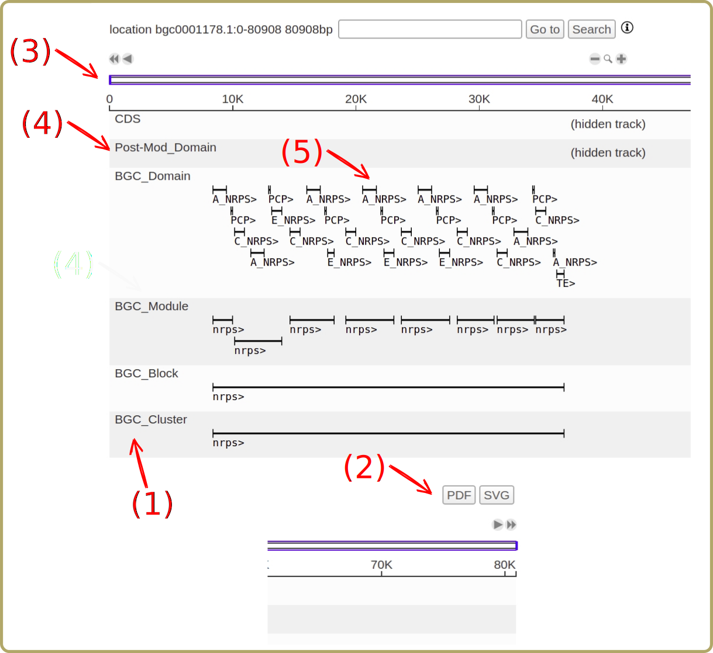

.. _genome_browser:

Genome browser
##############

In order to allow a graphical view of the genome and the clusters a genome browser is incorporated into SeMPI 2.0. The browser visualizes the genes (CSD), biosynthetic gene cluster (BGC) relevant domains, postsynthetic modification related domains, modules, blocks and clusters together in a interactive browser. For a detailed explanation please see the `D3 Genome Browser D3GB <http://d3gb.usal.es/help/index.html>`_
help page.

Usage
=====

.. figure:: img/screenshots/genome_browser_01.svg
   :scale: 50 %
   :alt: genome_browser_01

(1) The genome browser is available for the entire analyzed genome.
(2) But the browser can also be limited to the predicted cluster  (2) (and 10000bp of its surrounding).

(1) The browser visualizes the genes (CDS), biosynthetic gene cluster (BGC) relevant domains, postsynthetic modification related domains (Post-Mod),  modules, blocks and clusters. 
(2) The figure can be exported in SVG and PDF format. 
(3) The area of display can be expanded/changed and contracted using the top panel.
(4) By clicking on the side panel text, the block can be collapsed, which is useful when too many genes/domains are shown (if the entire genome is shown thousands of genes might be displayed).
(5) By clicking on the field of interest additional information are displayed.
