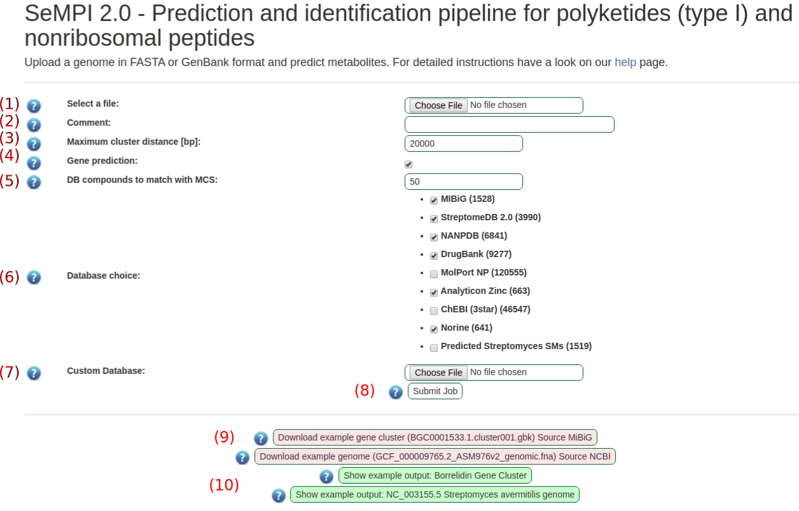
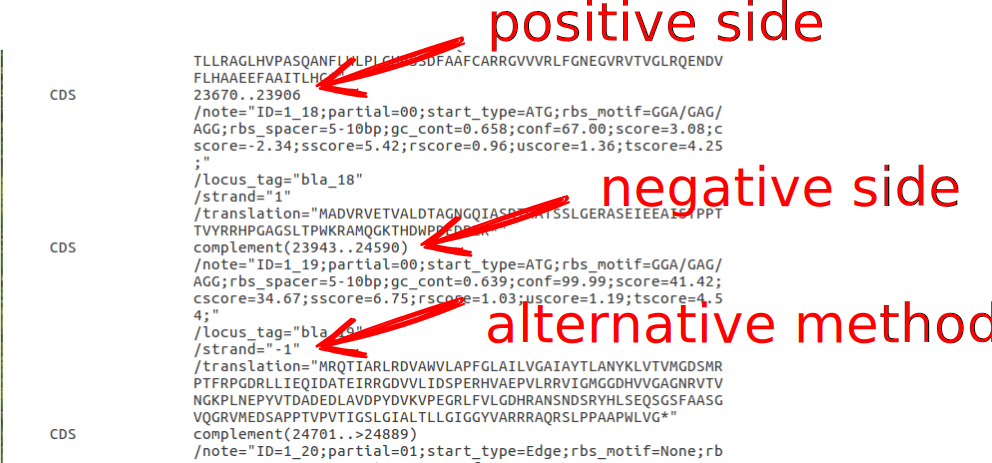
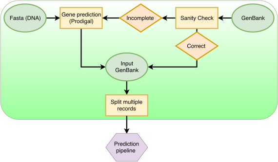

Genome input
############

Input form
============

   Screenshot of the input view.

#. Upload a gene file (DNA) in FASTA or GeneBank format. Drop and drag is also supported.
#. Its easy to get confused, when multiple files are submitted to the server. Therefore the jobs can be commented, which allows simple identification when the jobs are done. An example could be "interesting genome Number 3". This field is optional.
#. This threshold which defines the maximum distance between functional modules to be detected as one gene cluster.
#. Force the gene prediction algorithm. The genes will be predicted using prodigal, based on the provided DNA. Otherwise the genes will only be predicted if they cannot be found in the input data. Precomputed genes need to be assigned in a GeneBank file using the CDS tag (https://www.ncbi.nlm.nih.gov/Sitemap/samplerecord.html#CDSB). As SeMPI 2.0 needs the stand side information of the gene (+ or -) for reasonable cluster predictions, files where the strand side is not assigned will automatically lead to a gene prediction (see Example :numref:`cds-strand`).
#. The screening algorithm uses fingerprints to detect similar compounds in the DBs (this gives already close matches). Of those matches the best N. compounds are used for a stricter screening process using maximum common substructures (MCS). The MCS algorithm can take a while to process, therefore it is recommended to limit the number of compounds selected for this task (see also :ref:`fp_screen`).
#. Possible database choices for the screening process.
#. Additionally to the provided DBs, you can provide your own DB in SDF or SMILES format (limited to 1000 entries.) See the :ref:`custom_db` for a guide to format the input file. You can also use only a custom DB. If you think you have a natural product DB, which can be useful as a permanent option, please contact us and we will include it.
#. The provided files allow for a test run of the web server. They need to be downloaded and can then be used as input file.
#. There are also preprocessed results available.

.. _cds-strand:

   Example of a GeneBank file with pre-computed genes.

Input format
============

SeMPI can work with genome data in FASTA or GenBank format. 
The files can contain multiple records. SeMPI will
create one result page for each record. 
An example file for both formats can be download from the start page.

Input parsing
=============

   Flow chart of the input parsing pipeline. If only DNA data is provided, the genes are predicted using prodigal. If the genes are already assigned (GenBank) SeMPI will try to parse the genes and use them for further analysis. SeMPI can parse multiple records per file, it will create one output for each record.