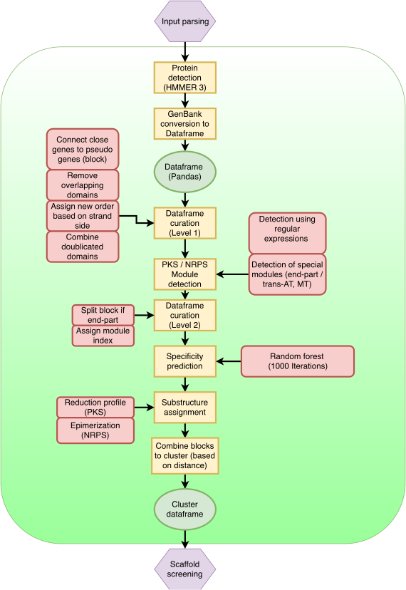

Prediction
############

Overview
========

   Flow chart of the prediction pipeline.

Curration (1)
=============

.. _df-processing:
.. figure:: img/df_processing.svg
   :scale: 50 %
   :alt: prediction

   Curration steps: (a) Block generation, (b) Domain reordering, (c) Domain overlap removal, (d) Domain doublication joining.

After the protein detection the genome is converted into a data frame (pandas), which simplifies the subsequent operations. Additional, pandas allows to apply vectorized functions, which speeds up the prediction pipeline. A mysql dump of the data frame is provided with the final output.

The data frame is curated and modified in order to prepare the BGC module detection (see Example :numref:`df-processing`). 
(a) Close genes (<= 5000bp) which encode proteins on the same strand are combined into blocks. A detailed observation of the MIBiG annotated NRPS and PKS clusters showed, that for this condition the co-linearity principle applies for the very most cases. 
(b) The domains are ordered based on the occurrence in the genome, but for module assignment it is more useful to order the domains based on the occurrence in the block, therefore an additional index is assigned based on the block order. 
(c) In very rare cases the detected protein domains overlap. This can be the case especially for very short sequences (for example the ACP domain). If the domains overlap to more then 20% the domain with the lower bitscore is removed. 
(d) Sometimes the HMM algorithm detects two domains behind each other instead of one domain, these domains are automatically joined to one domain.

Protein prediction
==================

The detection of relevant proteins in the genes is performed using profile hidden Markov models (pHMMs) created with HMMER 3.0. This step is common to most prediction tools at present. But as HMMER 3.0 is the state-of-the-art for sensitive sequence homologue detection, there is no reason to reinvent the wheel. Nevertheless, SeMPI uses its own profiles created with in-house sequence databases. The following proteins are detected: 

.. csv-table:: HMM profiles used for domain detection
   :header: "Full name", "Abbrev.", "Remark"
   :widths: 5, 5, 10
   :file: tables/hmm_domains.csv
