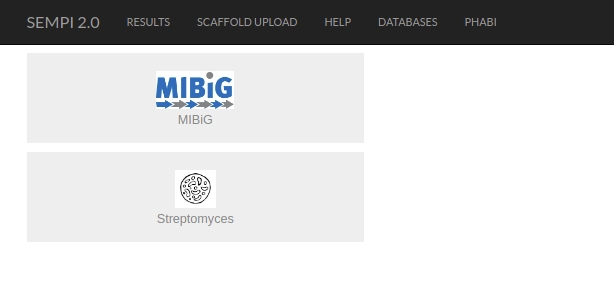
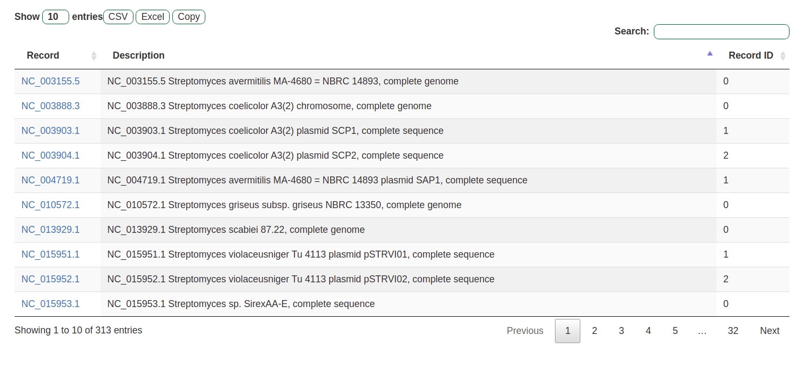
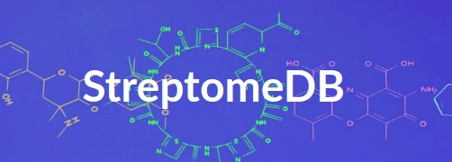
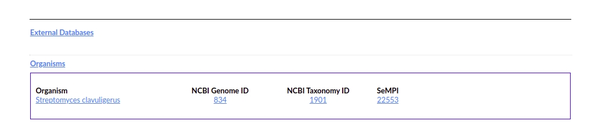

Preprocessed Database
#####################

.. _scoring:

SeMPI 2.0 also includes two preprecessed databases. 
All PKS and NRPS gene clusters of the MIBiG were also processed with SeMPI 2.0.
Fruthermore a selection of streptomyces genomces are also available.

.. _scoring:

The streptomyces genomces correspond to genomes related to secondary metabolites stored in the 
`streptomeDB 3.0 <http://www.pharmbioinf.uni-freiburg.de/streptomedb>`_ .

.. _scoring:

The preprecessed genomes are linked on the corresponding compound card:

.. _scoring:

This interoperability allows for the comparison of predicted scaffolds to the described secondary metabolites. 