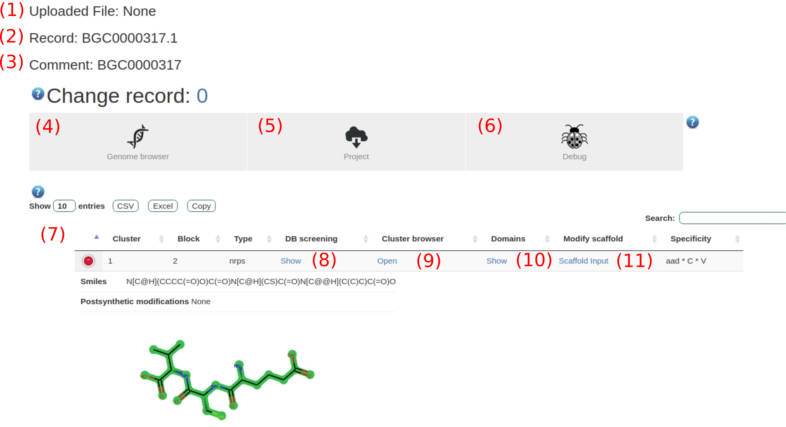

Result page
###########

.. _res_example:

   Overview of the results page. 

#. The uploaded file.
#. The record. Can be changed by clicking on the links above (4)
#. A comment for identification which can be chosen in the input form.
#. A link to the genome browser which is further explained in :ref:`genome_browser`.
#. The generated files for the genome can be downloaded. The folder set-up is explained in :ref:`output_files`.